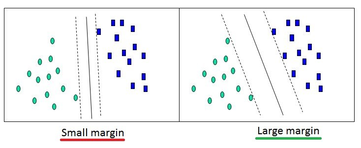
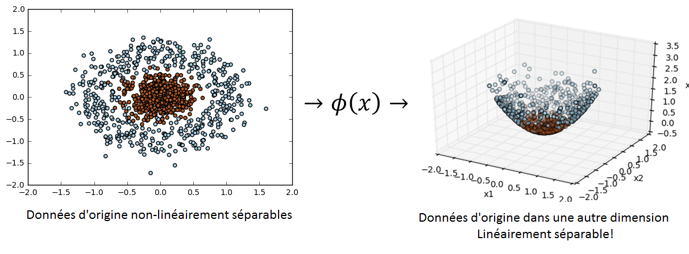
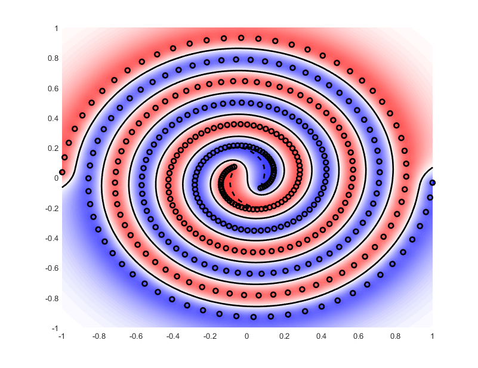

Séparateurs à vaste marge (SVM)
===============================

Objectif
########

Optimiser une fonction représentant la meilleure droite (ou hyperplan) de séparation/frontière entre chaque classe. Il peut y avoir plusieurs frontières.
Maximiser la marge (distance) entre la frontière et les données :

L'objectif du SVM est de trouver une dimension dans laquelle on peut linéairement séparer nos données. Il s’agit donc de trouver une fonction :math:`\phi` qui projette nos données dans une autre dimension :

.. math::

   	\text{Données} \xrightarrow{\phi} \text{Caractéristiques}

.. math::

   	X_n \xrightarrow{\phi} Y_m

D'après le `théorème de Cover <https://en.wikipedia.org/wiki/Cover's_theorem>`_, quel que soit le problème, il existe une dimension dans lequel il est linéairement séparable.

Le SVM est un problème convexe. On peut donc le résoudre avec une simple descente de gradient afin de trouver l’optimum global de notre problème. On peut aussi utiliser la méthode de Newton mais elle risque de prendre plus de temps.

Vecteur support
###############

* Seul les données proches de la frontière sont utiles pour entrainer un SVM : ce sont les vecteurs support.
* Les données éloignées de la frontière ne sont pas prises en compte pour l’entrainement.
* Les vecteurs support sont donc ceux qui servent à définir la formule de la droite.
* Nous cherchons à avoir un minimum de vecteurs support à la fin de l’entrainement.
* Pour choisir entre deux kernels présentant des résultats similaires, il faut regarder le nombre de vecteurs support qu’ils utilisent. Celui qui en a le moins sera celui qui généralisera le mieux.
* Dans nos problèmes d’optimisation, il s’agit de la variable :math:`\alpha`. Ainsi :

  * Si le point est un vecteur support : :math:`\alpha > 0`
  * Si le point n’est pas un vecteur support : :math:`\alpha = 0`

Hard margin
###########

C’est la 1ère version de l’algorithme qui consiste simplement à séparer deux ensembles distincts n’ayant pas de « bruit » avec un SVM linéaire. Attention, la notion de « bruit » n’est pas forcément correcte, on parlera plutôt de « cas particuliers », en effet, il peut arriver que ces exemples soient corrects et non pas issus d’un quelconque bruit.
Le problème d’optimisation associé dit problème « primal » est le suivant :

.. math::

   g(x) = w^{T}x + b

.. math::

   \arg\max_{w}\frac{2}{\left \|w\right \|}\leftrightarrow \arg\min_{w}\frac{1}{2}\left \|w\right \|^{2}

.. math::

   s.c.: \left\{ \begin{array}{ll} y_i(w^Tx_i+b)>=1 \end{array} \right.

Cependant, dans certains cas, ce problème « primal » est trop complexe à résoudre.

On peut reformuler ce problème avec les `Multiplicateurs de Lagrange <https://fr.wikipedia.org/wiki/Multiplicateur_de_Lagrange>`_ (:math:`= \alpha_i`), c’est la version « dual » du problème :

.. math::

   \mathcal{L}(\alpha)=Q(\alpha)=\sum_{i}{\alpha_i}-\frac{1}{2}\sum_{i}{\sum_{j}{\alpha_i\alpha_jy_iy_j<x_i,x_j> }}

.. math::

   s.c.: \left\{ \begin{array}{ll} 0\leq \alpha_i\\\sum\limits_{i=1}^{N}{\alpha_iy_i}=0 \end{array} \right.

Il ne nous reste donc plus qu’à trouver le :math:`\alpha=(\alpha_1 ... \alpha_n) \neq 0` qui maximise la marge. Un algorithme très utilisé pour résoudre ce problème d’optimisation quadratique est le « Sequential minimal optimization » ou « `SMO <https://en.wikipedia.org/wiki/Sequential_minimal_optimization>`_ ».

Soft margin
###########

C’est la 2nde version de l’algorithme, qui prend en compte le bruit. Sans prendre en compte le bruit, le SVM serait forcé de trouver un séparateur linéaire parfait (qui classifie correctement tous les exemples), ce qui entrainerait surement un sur-apprentissage.

On introduit pour chaque exemple , ce qu’on appelle des « variables latentes » notées : :math:`\xi_i\geq 0`.

Les variables latentes ...

* ... :math:`\xi_i=0` indiquent que les exemples associés sont bien classés et se trouvent sur ou en dehors de la marge.
* ... :math:`0\leq \xi_i\leq 1` indiquent que les exemples associés se trouvent dans la marge de leur classe.
* ... :math:`1< \xi_i\leq 2` indiquent que les exemples associés se trouvent dans la marge de l’autre classe.
* ... :math:`2<\xi_i` indiquent que les exemples associés sont mal classés et en dehors de la marge.

Celles-ci représentent en fait, pour chaque exemple dans la marge ou mal classé, la distance qui le sépare de la marge de sa classe.
On introduit pour la suite un hyperparamètre/une constante `C <http://www.svms.org/parameters/>`_ : qui contrôlera le compromis entre l’erreur (:math:`\textstyle\sum_{i}{\xi_i}`) et la marge.

* Lorsque :math:`C` est petit, on est « laxiste » :

  * Faible variance : moindre sensibilité aux variations dans les exemples.
  * Biais plus fort : on veut des hypothèses de grande marge.

* Lorsque :math:`C` est grand, on est « sévère » :

  * Forte variance : grande sensibilité aux particularités dans les exemples.
  * Biais plus faible : on est moins exigeant sur la marge
  * Avec :math:`C\rightarrow +\infty`, on va tendre vers un SVM « hard margin » (on fait du sur-apprentissage).

On peut reformuler ce problème avec les Multiplicateurs de Lagrange (:math:`=\alpha_i`), c’est la version « Dual » du problème :

.. math::

   \arg\min_{w}\frac{1}{2}\left \|w\right \|^{2}+C\sum_{i}{\xi_i}

.. math::

   s.c.: \left\{ \begin{array}{ll} 0\leq \alpha_i\leq C \\\sum\limits_{i=1}^{N}{\alpha_iy_i}=0 \end{array} \right.

Il ne nous reste donc plus qu’à trouver le :math:`\alpha=(\alpha_1 ... \alpha_n) \neq 0` qui maximise la marge. On peut toujours utiliser l'algorithme « SMO ».

Kernel
######

Il peut être difficile de trouver une fonction qui projette les données dans la bonne dimension. Pour résoudre ce problème, les SVM introduisent des fonction dites « kernel ».
Il s’agit en fait simplement d’un produit scalaire :

.. math::

   k(a,b)=<a,b>=\phi(a)\cdot \phi(b)

D’après le théorème de `Mercer <https://en.wikipedia.org/wiki/Mercer%27s_theorem>`_, **toute fonction kernel continue, symétrique, semi-définie positive, peut être exprimée sous la forme d’un produit scalaire dans un espace de grande dimension**.
Ainsi on travaille uniquement sur des produits scalaires, et non pas sur les valeurs des vecteurs. Cela permet d’avoir une dimension de projection infinie si nécessaire.

Propriétés
----------

.. math::

   k(a,b)=k_1(a,b)+k_2(a,b)

.. math::

   k(a,b)=k_3(a,b)*k_4(a,b)

.. math::

   k(a,b)=c*k_5(a,b)

.. math::

   k(a,b)=k_6(\phi(a),\phi(b))

Fonctions kernels communes
--------------------------

* Kernel linéaire :

.. math::

   k(x_i,x_j)=x_i^Tx_j+1
   
* Kernel polynomial d'ordre n :

.. math::

   k(x_i,x_j)=(x_i^Tx_j+1)^n

* Kernel Laplacien :

.. math::

   k(x_i,x_j)=\exp\left(-\frac{\left \| x_i-x_j \right \|}{\sigma}\right)

* Kernel exponentiel :

.. math::

   k(x_i,x_j)=\exp\left(-\frac{\left \| x_i-x_j \right \|}{2\sigma^2} \right )

* Kernel Gaussien ou `RBF <https://en.wikipedia.org/wiki/Radial_basis_function>`_ (Radial Basis Function) :

  * Plus :math:`\theta` est petit, plus il fait du sur-apprentissage     
  * Plus :math:`\theta` est grand, plus il tend vers du linéaire

.. math::

   k(x_i,x_j)=\exp\left( \frac{\left \| x_i-x_j \right \|^2}{2\sigma^2} \right )=\exp\left(-\gamma\left \| x_i-x_j \right \|^2 \right )

La matrice de Gram
------------------

.. math::

   G=\begin{bmatrix} k(x_1,x_1) & \dots & k(x_1,x_n) \\ \vdots & \ddots & \vdots \\ k(x_n,x_1) & \dots & k(x_n,x_n) \end{bmatrix}=X^TX

Si :math:`G` est semi-définie positive, alors :math:`\phi` existe. Équivalent à vérifier que :math:`G_i_j>0`.

Exemple
-------

Par exemple, on peut résoudre le problème de classification suivant :

Astuces
-------

* Toujours commencer par un kernel linéaire pour savoir si le problème est linéairement séparable dans la dimension actuelle.
* Pour que les calculs soient rapides, il faut centrer-réduire les données.
